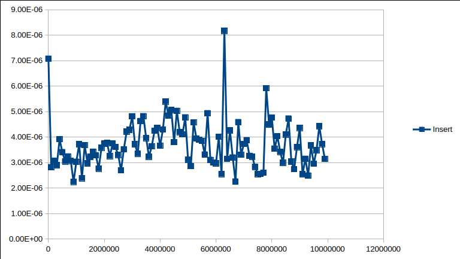
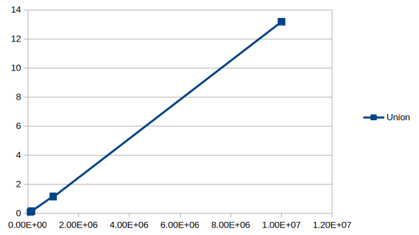
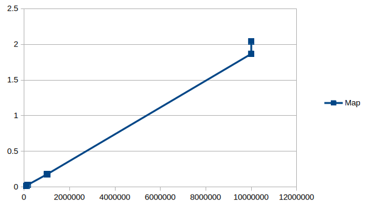

# Лабораторная работа 4

## Зависимости

Компилятор, совместимый со стандартом C++11; CMake

```bash
pacman -Syu gcc cmake
```

## Компиляция

```bash
mkdir -p build
cd build
cmake ..
make
```

## Тестирование

```bash
cd build
ctest
```

## Пользовательский интерфейс

```bash
cd build
userInterface
```

## Тестирование на больших данных

Все тесты производились на структуре данных множество, инкапсулирующее бинарное дерево поиска (КуРево - Куча + Дерево, также известное как декартово дерево или Treap на английском языке)






